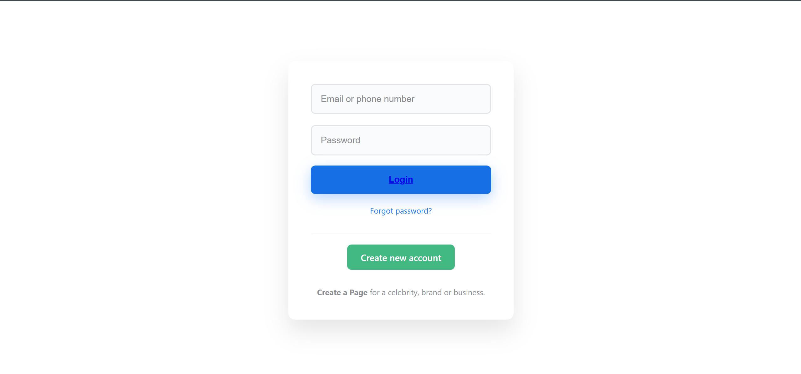

# midterm
## Yi Monirom

### set up clone the repository 
```
.git clone https://github.com/Yi-Monirom/I3_typing_master.git
// cd to dir 
.cd I3_typing_master

```
### compile and run by find main html file name: mainPage.html in folder html
```
run using 'Live Preview' all open file in chrome location
you'll see 


```

```
that has 6 button 
    -click login will see log in page
```

```
if 
    -click sign in will register Page
```

```
and other buttons will navigate to it's page 
```
### Or
```
you can see the image in folder /img
``` 


